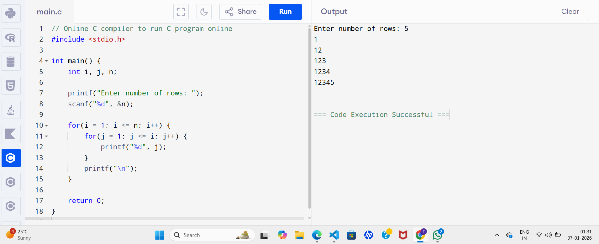

# 🔢 Numeric Pattern Logic System

## 📄 1. Project Overview  
The **Numeric Pattern Logic System** is a console-based C program that generates numeric patterns based on user input. By utilizing loops and nested loops, the program displays numbers in structured patterns. This project helps beginners strengthen programming logic, understand fundamental C concepts, and develop problem-solving skills.

## 🎯 2. Objective of the Project  
The main objective of this project is to enhance logical thinking and programming skills through practical implementation of loops and nested loops. Generating numeric patterns helps learners visualize algorithmic flow and strengthens problem-solving abilities.

## 🛠️ 3. Utility of the Project  
- Helps understand basic programming concepts in C  
- Provides practical experience with loops and nested loops  
- Supports exam and viva preparation  
- Beginner-friendly project for learning pattern logic

## 🚀 4. Future Scope  
- Addition of more numeric and mathematical pattern types  
- Development of a menu-driven system for pattern selection  
- Integration of star, alphabetic, and mixed patterns  
- Upgrade to GUI-based applications or advanced programming languages  

## 📐 5. Algorithm Overview  
1. Start the program  
2. Accept the number of rows from the user  
3. (Optional) Let the user select the type of pattern  
4. Use outer loop to control rows  
5. Use inner loop to print numbers according to the selected pattern  
6. Display the pattern on the console  
7. End the program  

## 🖥️ 6. Output Screenshot  
The following screenshot demonstrates the output generated by the program:

*Figure 1: Console output showing numeric pattern generation*

